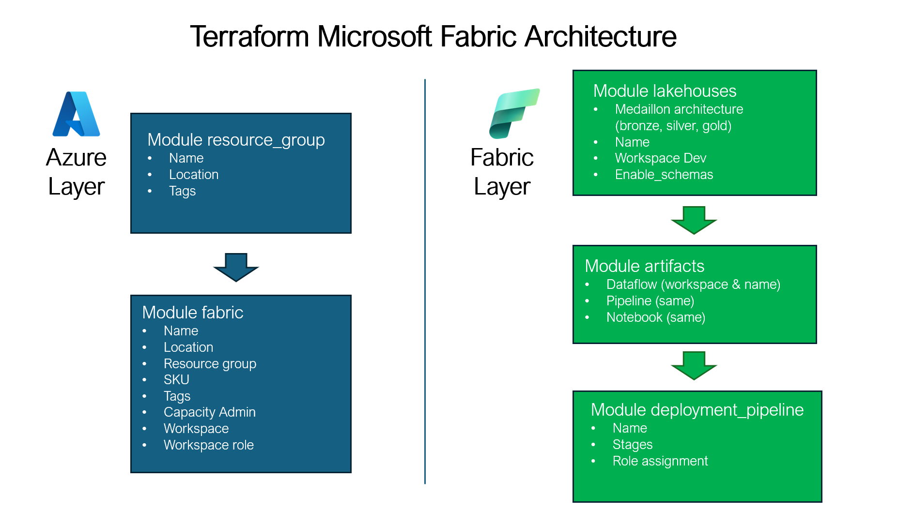

# Microsoft Fabric Terraform Deployment

Provision a complete Microsoft Fabric foundation on Azure using Terraform. The stack creates an Azure resource group, a Fabric capacity, three Fabric workspaces (DEV/TEST/PROD), Medallion lakehouses in DEV, and core artifacts in DEV: Dataflow Gen2, Data Pipeline, and Notebook.

**What You Get**
- Resource group in your chosen Azure region
- Microsoft Fabric capacity (configurable SKU)
- Three Fabric workspaces on the same capacity: DEV, TEST, PROD
- Fabric Deployment Pipeline linking DEV -> TEST -> PROD
- DEV lakehouses (bronze, silver, gold) with optional schemas
- DEV artifacts: Dataflow Gen2, Data Pipeline, Notebook

**Who This Is For**
- Data/Platform engineers bootstrapping Fabric environments quickly
- Teams standardizing naming, governance, and repeatable provisioning

## Architecture Overview

Below is the Terraform Microsoft Fabric architecture:




## Prerequisites
- Terraform >= 1.8
- Active Azure subscription with sufficient permissions (Contributor or Owner)
- Azure CLI installed and authenticated with sufficient permissions
  - Install: https://learn.microsoft.com/cli/azure/install-azure-cli
  - Sign in: `az login` (or `az login --use-device-code`)
- Providers used: `hashicorp/azurerm`, `Azure/azapi`, `hashicorp/azuread`, `microsoft/fabric`


## Repository Structure
```
.
├── main.tf                      # Root wiring for modules and roles
├── providers.tf                 # Providers and versions
├── variables.tf                 # Root module inputs (incl. artifacts, lakehouses)
├── outputs.tf                   # Handy outputs after apply
├── terraform.tfvars.example     # Sample user configuration
├── modules/
│   ├── resource_group/          # Azure Resource Group
│   ├── fabric/                  # Fabric capacity + workspaces (+ group roles)
│   ├── lakehouses/              # DEV lakehouses (bronze/silver/gold)
│   └── artifacts/               # DEV Dataflow Gen2, Pipeline, Notebook
│   └── deployment_pipeline/     # Fabric Deployment Pipeline (DEV -> TEST -> PROD)
```


## Quick Start
1) Authenticate and select subscription
```
az login
az account set --subscription "<SUBSCRIPTION_ID>"
# List available subscriptions (helpful when choosing the `subscription_id`):
az account list --query "[].{Name:name, Id:id, IsDefault:isDefault}" -o table
```

2) Configure inputs by copying the example
```
cp terraform.tfvars.example terraform.tfvars
# Edit terraform.tfvars with your values
```

3) Initialize, plan, and apply
```
terraform init

# First-time apply (capacity data source depends on capacity creation)
# 1) Creates the Azure Resource Group
terraform apply -auto-approve -var-file="terraform.tfvars" -target module.resource_group.azurerm_resource_group.this
# 2) Creates the Microsoft Fabric Capacity
terraform apply -auto-approve -var-file="terraform.tfvars" -target module.fabric.azurerm_fabric_capacity.this

# Then proceed normally
terraform plan   -var-file="terraform.tfvars"
terraform apply  -var-file="terraform.tfvars"
```

### First-Time Apply Scenarios
- Terraform creates RG and Capacity (default)
  - Use the targeted applies above once, then run plan/apply normally.
- You already created the Resource Group and/or Capacity
  - Ensure names in this repo match your existing assets. By default, names are derived in `terraform-ms-fabric/main.tf` as:
    - Resource group: `<client>-fabric-rg-<environment>`
    - Capacity display name: computed from `<client>` and `<environment>`
  - If your names differ, update the `names` locals in `terraform-ms-fabric/main.tf` or adjust `client`/`environment` inputs to match.
  - Import existing resources into Terraform state, then plan/apply:
    ```bash
    # Import the existing Resource Group
    terraform import \
      module.resource_group.azurerm_resource_group.this \
      "/subscriptions/<SUBSCRIPTION_ID>/resourceGroups/<RG_NAME>"

    # Import the existing Fabric Capacity
    terraform import \
      module.fabric.azurerm_fabric_capacity.this \
      "/subscriptions/<SUBSCRIPTION_ID>/resourceGroups/<RG_NAME>/providers/Microsoft.Fabric/capacities/<CAPACITY_NAME>"

    # Then proceed normally
    terraform plan  -var-file="terraform.tfvars"
    terraform apply -var-file="terraform.tfvars"
    ```
  - If only the Resource Group exists (no Capacity yet): skip the RG targeted apply and run only the Capacity targeted apply once.

## Configuration (Inputs)
- `client` (string, required)
  - Naming prefix for resources (client/tenant). Allowed: lowercase letters, numbers, hyphens `[a-z0-9-]`.
- `environment` (string, required)
  - Deployment environment suffix. One of: `dev`, `test`, `prod`.
- `location` (string, default `"francecentral"`)
  - Azure region for the deployment.
- `fabric_capacity_sku` (string, default `"F2"`)
  - Fabric capacity size (e.g., `F2`, `F4`, `F8`).
- `subscription_id` (string, required)
  - Azure subscription ID used by providers.
- `tags` (map(string), default `{}`)
  - Common tags applied to supported resources (e.g., RG, capacity).
- `enable_schemas` (bool, default `true`)
  - Enable schemas feature on each created lakehouse. Changing this forces lakehouse replacement.
- `workspace_group_assignments` (list(object), default `[]`)
  - Assign Azure AD group roles to Fabric workspaces. Object: `{ group_object_id (opt), group_display_name (opt), role (string), workspaces (list(string), opt) }`. If `workspaces` is empty, applies to all created workspaces.
- `artifacts_dataflow_usage` (string, default `"ingest"`)
  - Usage token for Dataflow Gen2 naming (pattern: `df_<usage>_<workspace>`).
- `artifacts_pipeline_usage` (string, default `"orchestrate"`)
  - Usage token for Data Pipeline naming (pattern: `pl_<usage>_<workspace>`).
- `artifacts_notebook_usage` (string, default `"explore"`)
  - Usage token for Notebook naming (pattern: `nb_<usage>_<workspace>`).
- `deployment_pipeline_role_assignments` (list(object), default `[]`)
  - Assign Azure AD principals to the Fabric Deployment Pipeline. Only role `Admin` is supported. For groups, provide `group_object_id` or `group_display_name`; for users, provide `user_object_id` or `user_principal_name`.

Example `terraform.tfvars` snippet:
```hcl
client              = "customer"
environment         = "dev"
location            = "francecentral"
fabric_capacity_sku = "F2"
subscription_id     = "00000000-0000-0000-0000-000000000000"

tags = {
  environment = "dev"
  owner       = "data-team"
}

enable_schemas = true

workspace_group_assignments = [
  {
    group_object_id = "<aad-group-object-id>"
    role            = "Contributor"           # Admin | Member | Contributor | Viewer
    workspaces      = ["<workspace-name>"]    # empty -> applies to all created workspaces
  }
]

artifacts_dataflow_usage  = "ingest"
artifacts_pipeline_usage  = "orchestrate"
artifacts_notebook_usage  = "explore"
```

Note: Do not commit your `terraform.tfvars` with real identifiers.

### Naming Note
- If the `client` variable changes after an initial apply, the derived workspace names change as well. You must update the existing Fabric workspace names to match the new `client` value (or destroy/recreate or import state accordingly) to avoid drift and naming conflicts.

## Lakehouses (DEV)
- Provisions three lakehouses in DEV following Medallion architecture: `bronze`, `silver`, `gold`.
- Naming pattern: `lh_<layer>_<workspace>`; hyphens in the workspace are converted to underscores and only `[A-Za-z0-9_]` are kept.
- Output: `dev_lakehouses` exposes a map keyed by layer with `{ id, name }`.
- Customize layers and prefix via `modules/lakehouses` and the module call in `main.tf`.
- Schemas toggle: `enable_schemas = true` by default; changing it replaces lakehouses.

## Artifacts (DEV): Dataflow, Pipeline, Notebook
- Creates one of each in DEV with consistent names:
  - Dataflow Gen2: `df_<usage>_<workspace>` (usage from `artifacts_dataflow_usage`)
  - Data Pipeline: `pl_<usage>_<workspace>` (usage from `artifacts_pipeline_usage`)
  - Notebook: `nb_<usage>_<workspace>` (usage from `artifacts_notebook_usage`)
- Output: `dev_artifacts` returns `{ dataflow = {id,name}, pipeline = {id,name}, notebook = {id,name} }`.
- Extend by duplicating the module under `modules/artifacts` and adjusting usage tokens or adding additional artifacts.

## Deployment Pipeline
- Creates a Microsoft Fabric Deployment Pipeline that connects the three workspaces as stages: Development -> Test -> Production.
- Name pattern: `<client>-fabric-deployment-pipeline`.
- Stages map to the workspaces created by this stack:
  - Development: `<client>-DEV`
  - Test: `<client>-TEST`
  - Production: `<client>-PROD`
- Role assignments: supports Azure AD Group/User principals; only `Admin` is valid for deployment pipelines. Configure via `deployment_pipeline_role_assignments`.
- Outputs:
  - `deployment_pipeline.id` and `deployment_pipeline.name`
  - `deployment_pipeline.role_assignments` map with `id`, `role`, `principal_id`, `principal_type`

Example `terraform.tfvars` snippet:
```hcl
# Grant Admin on the Deployment Pipeline to a platform group and a user
deployment_pipeline_role_assignments = [
  {
    role               = "Admin"
    principal_type     = "Group"           # Group or User
    group_object_id    = "<aad-group-object-id>" # prefer object ID (discouraged: group_display_name)
  },
  {
    role                 = "Admin"
    principal_type       = "User"
    user_principal_name  = "john.doe@contoso.com" # prefer user_object_id; UPN lookup is mutable
  }
]
```

## Terraform Commands
```
terraform init       # Download providers and initialize
terraform fmt        # Format configuration
terraform validate   # Static validation
terraform plan       # Preview changes
terraform apply      # Apply changes
terraform destroy    # Destroy the stack
```

## Best Practices
- Secrets: store sensitive values in Azure Key Vault or env vars; never commit secrets or state.
- Remote state: use a shared backend (Azure Storage, Terraform Cloud) for team collaboration and locking.
- Workspaces: `terraform workspace new dev` to isolate environments with the same code.
- Reviews: open PRs with plan output and rationale for changes.

## References
- Microsoft Fabric Terraform Provider: https://registry.terraform.io/providers/microsoft/fabric/latest/docs
- AzureRM Provider: https://registry.terraform.io/providers/hashicorp/azurerm/latest/docs
- Terraform on Azure: https://learn.microsoft.com/azure/developer/terraform/
